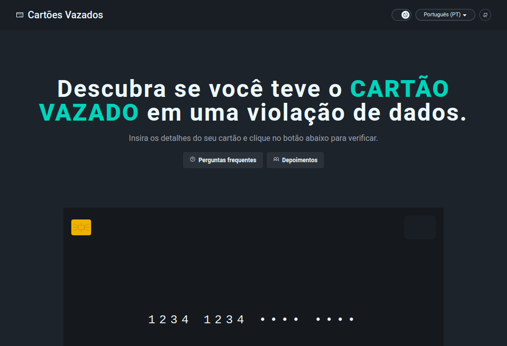

# Descubra se seu Cartão Foi Vazado

## Visão Geral

Este projeto é um site criado com o objetivo de conscientizar pessoas, especialmente idosos, sobre os riscos de fornecer informações pessoais e sensíveis na internet. A ideia central é simular um ambiente que, à primeira vista, parece totalmente seguro e legítimo, mas que, após o usuário inserir os dados do seu cartão, revela de forma impactante os perigos reais de cair em golpes online.

## Funcionalidades do Projeto

- **Formulário de Verificação:** Um formulário onde o usuário insere os dados do cartão, simulando uma checagem de segurança.
- **FAQ Convincente:** Seção de Perguntas Frequentes que reforça a legitimidade do site, com respostas cuidadosamente elaboradas para criar confiança.
- **Depoimentos Falsos:** Comentários simulados de supostos usuários satisfeitos para aumentar a sensação de credibilidade.
- **Selos de Segurança:** Imagens e ícones que imitam certificações de segurança para enganar e criar um ambiente de total confiança.
- **Simulação de Análise:** Uma tela com um timer ou indicador que gera expectativa, simulando um processo de verificação real.
- **Mensagem de Alerta Impactante:** Após a simulação de análise, o usuário recebe uma mensagem forte que revela o verdadeiro propósito do site, alertando-o sobre os perigos de compartilhar dados sem confirmar a confiabilidade do site.
- **Botão de Compartilhamento:** Incentiva o usuário a compartilhar a experiência e conscientizar amigos e familiares.

## Abordagens Psicológicas Utilizadas

- **Confiança Iniciais:** Ao exibir FAQs, depoimentos e selos de segurança, o site usa a técnica de _persuasão pela autoridade_ e _prova social_, elementos que geram confiança e reduzem a desconfiança inicial do usuário.
- **Construção de Expectativa:** A simulação de uma análise com um timer aumenta a ansiedade e a curiosidade, preparando emocionalmente o usuário para o impacto da mensagem final.
- **Choque e Realização:** A mensagem final é desenhada para criar um efeito de choque, utilizando o medo e a surpresa para incentivar uma reflexão imediata sobre os riscos de compartilhar informações pessoais online.
- **Reforço Preventivo:** Ao finalizar com um chamado à conscientização e compartilhamento, o site reforça a importância de estar sempre alerta e de se informar antes de inserir dados sensíveis na internet.

## Objetivos e Benefícios

- **Educação Digital:** Mostrar de forma prática e impactante como é fácil ser enganado por sites fraudulentos, incentivando os usuários a sempre verificar a autenticidade dos sites antes de fornecer dados.
- **Prevenção de Fraudes:** Ao simular um golpe, o projeto busca alertar o público sobre as técnicas utilizadas por golpistas e as possíveis consequências de um vazamento de informações.
- **Conscientização:** Promover a disseminação de boas práticas de segurança online, ajudando a proteger não apenas os usuários, mas também suas famílias e comunidades.

## Importante

- **Privacidade Garantida:** Nenhum dado inserido no site é salvo ou compartilhado. Todas as informações são descartadas imediatamente após a simulação.
- **Propósito Exclusivamente Educacional:** O objetivo deste projeto é apenas "assustar" e conscientizar sobre os perigos reais dos golpes online.
- **Ambiente Simulado:** Todos os elementos que simulam segurança (FAQs, depoimentos, selos) foram criados unicamente para demonstrar como golpistas podem enganar usuários desinformados.

## Conclusão

Este site é uma ferramenta de conscientização que utiliza técnicas psicológicas para educar sobre a segurança na internet. Ao criar um ambiente que parece confiável e, em seguida, revelar os riscos de fornecer dados pessoais, esperamos incentivar uma atitude mais cautelosa e informada entre os usuários.

---

_Este projeto foi desenvolvido para fins educacionais e de conscientização sobre segurança digital. Use-o para promover o diálogo e a prevenção contra fraudes na internet._
